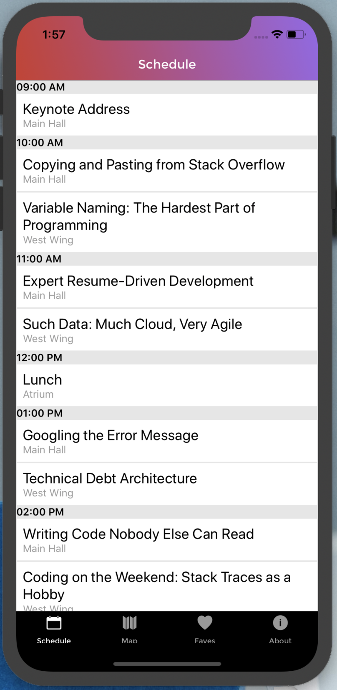
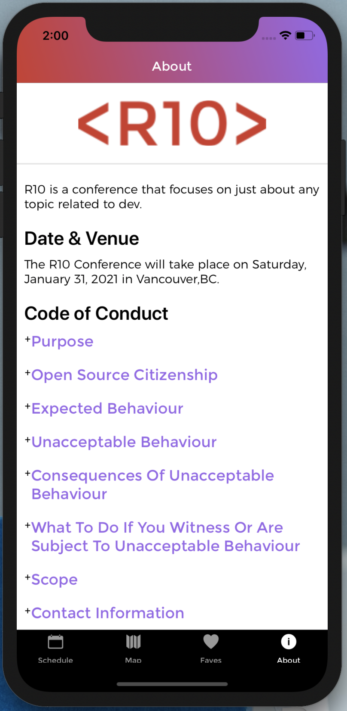

# R10

- This is an iOS/Android React Native mobile app for a developer's conference held in Vancouver called R10.

## Technologies Used

- React
- React Native
- Apollo Client
- Async Storage
- Moment.js
- React Native Vector Icons

## Dependencies Installation

## Installation

- (iOS) Install Xcode before start

- (Android) Install Android Studio

### For iOs

- Requires XCode
- 'react-native run-ios'

### For Android

- Requires Android Studio
- 'react-native run-android'

1. Install dependencies


    `yarn install` or  `npm install`

2. Start emulator

### iOS

```
yarn run:ios
```

### Android

```
yarn run:android
```

## Some User Interface Screens of R10






## Personal Learnings

- Using React Native and its specific styling components
- React Native navigation and use of stacks
- Navigating between various React Native screens
